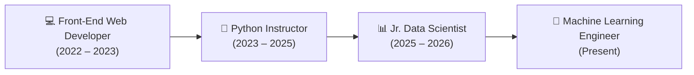

<div align="center">

# 🌟 Aniket Tayade | Portfolio

### **Machine Learning Engineer & Full-Stack Developer**

Building production-grade ML solutions, generative AI applications, and high-performance interactive web experiences.

[](https://nextjs.org/)
[](https://react.dev/)
[](https://www.typescriptlang.org/)
[](https://tailwindcss.com/)
[](https://threejs.org/)
[](https://www.framer.com/motion/)

<br />

[🔗 Live Portfolio](https://github.com/tayade-aniket) • [📄 Download Resume](/public/data_scientist_tayade_aniket.pdf) • [💼 LinkedIn](https://in.linkedin.com/in/aniket-g-tayade) • [🏆 Kaggle](https://www.kaggle.com/annitayade) • [✉️ Email](mailto:tayadeanni@gmail.com)

</div>

---

## 📌 Executive Summary

I’m a **Machine Learning Engineer** with a strong foundation in software engineering and teaching. I specialize in turning messy data and complex machine learning architectures into reliable, scalable applications that solve real-world problems.

My journey spans data science, LLM/RAG pipelines, computer vision, and backend systems, paired with a solid background in modern front-end engineering.

> *"I like building practical AI solutions rather than chasing buzzwords. I’m especially interested in projects where AI can solve a real problem, simplify something complicated, or save someone a few hours of repetitive work."*

---

## ✨ Portfolio Key Features

- **Liquid Section Morph Transitions**: Custom cubic-bezier SVG morph dividers and GPU-accelerated backdrop glow animations creating smooth, continuous transitions across sections.
- **3D Interactive Visualizations**: Real-time 3D models and floating diamond/orb meshes powered by `@react-three/fiber` and `@react-three/drei`.
- **Dynamic Particle Field**: Interactive particle network canvas responding to movement and time.
- **Morphing Section Spy Navbar**: Top navigation with fluid layout spring physics (`layoutId="navbarMorphPill"`) indicating the active section, plus a responsive mobile drawer.
- **Interactive Timeline**: Vertical timeline detailing professional journey across data science, instruction, and web development.
- **Skills Matrix with Dynamic Gauges**: Animated proficiency bars highlighting AI/ML, Languages, MLOps/Cloud, and Analytics.
- **Production Contact Form**: Integrated with Next.js App Router API route for email dispatch.

---

## 🛠️ Technology Stack

| Domain | Technologies & Libraries |
| :--- | :--- |
| **Frontend Framework** | Next.js 16 (App Router, Turbopack), React 19, TypeScript |
| **Styling & Design** | Tailwind CSS v4, Glassmorphism, CSS Custom Properties |
| **3D & Graphics** | Three.js, React Three Fiber (`@react-three/fiber`), Drei |
| **Animations** | Framer Motion 12 (Path Morphing, Spring Physics, Layout Animations) |
| **Icons & UI** | Lucide React, React Icons (Simple Icons) |
| **Machine Learning & AI** | PyTorch, Scikit-learn, LangChain, Groq LLM, YOLO, OpenCV, Tesseract OCR, BERT |
| **MLOps & Backend** | FastAPI, REST APIs, MLflow, Airflow, Docker, Git & GitHub, CI/CD, Streamlit |

---

## 🚀 Featured Projects

### 1. [Medical Report OCR using YOLO & Tesseract](https://github.com/tayade-aniket/Medical-Report-OCR-YOLO-Tesseract)
- **Domain**: Computer Vision & Deep Learning
- **Tech Stack**: `YOLO`, `Tesseract OCR`, `OpenCV`, `Python`, `Google Colab`
- **Summary**: End-to-end medical document analysis system utilizing YOLO for anatomical/tabular region detection and Tesseract for accurate text extraction, automatically transforming unstructured diagnostic reports into clean JSON/CSV format.

### 2. [NEWS Research Analysis Tool](https://github.com/tayade-aniket/news_research_analysis)
- **Domain**: Generative AI & NLP
- **Tech Stack**: `Groq LLM`, `LangChain`, `Streamlit`, `Plotly`, `Vector DB`
- **Summary**: Financial and research analysis platform that parses multi-source news articles, creates semantic vector embeddings, and enables conversational QA with instant verification, fact citation, and query history.

### 3. [Job Market Analytics Platform](https://github.com/tayade-aniket/job_market_analysis_NHIS)
- **Domain**: Data Analytics & NLP
- **Tech Stack**: `Python`, `Scikit-Learn`, `NLTK`, `Plotly`, `Streamlit`
- **Summary**: Data extraction and market trend prediction system evaluating real-time tech job postings to identify high-growth roles, salary distributions, and emerging skill demands.

### 4. [Twitter Disaster Classification](https://github.com/tayade-aniket/twitter_disaster_classification_NHITS)
- **Domain**: Natural Language Processing
- **Tech Stack**: `BERT`, `TF-IDF`, `Logistic Regression`, `Tokenization & Lemmatization`
- **Summary**: Disaster alert classification engine analyzing social media feeds in real time to categorize emergencies versus non-emergency chatter with high precision.

### 5. [Rossmann Store Sales Forecasting](https://github.com/tayade-aniket)
- **Domain**: Predictive Modeling & Time Series
- **Tech Stack**: `Random Forest`, `Gradient Boosting`, `XGBoost Regressor`, `Model Serialization`
- **Summary**: Predictive pipeline forecasting daily store sales across European retail locations, incorporating holiday schedules, promotions, and competitor distance features.

### 6. [Real Estate Pricing EDA](https://github.com/tayade-aniket/eda_for_real_estate_pricing-NHIS)
- **Domain**: Exploratory Data Analysis & Statistics
- **Tech Stack**: `Pandas`, `NumPy`, `Matplotlib`, `Seaborn`, `Jupyter`
- **Summary**: In-depth statistical analysis uncovering non-linear relationships, multi-collinearity, and property valuation drivers across housing markets.

---

## 💼 Work Experience



- **Jr. Data Scientist** — *NextHike IT Solutions (2025 – 2026)*
  - Developed PyTorch-based computer vision models for object detection and image segmentation.
  - Built experiment tracking and versioning pipelines with MLflow and Docker.
  - Enhanced hyperparameter tuning routines, improving training throughput and model accuracy.
- **Python Instructor** — *Vision Computer Academy (2023 – 2025)*
  - Instructed 400+ students in core Python programming, data structures, and backend API engineering.
  - Conducted hands-on labs for RESTful APIs with FastAPI and Django, version control (Git), and CI/CD pipelines.
- **Front-End Web Developer** — *Freelance & Independent Projects (2022 – 2023)*
  - Engineered responsive, component-driven web applications using React, Next.js, and Tailwind CSS.
  - Optimized client-side asset delivery, core web vitals, and RESTful API integrations.

---

## 📂 Project Architecture

```plaintext
portfolio/
├── public/                     # Static assets (3D textures, CV PDF, vector icons)
│   ├── data_scientist_tayade_aniket.pdf
│   └── textures/
├── src/
│   ├── app/
│   │   ├── api/
│   │   │   └── contact/        # Next.js API route for form submissions
│   │   │       └── route.ts
│   │   ├── favicon.ico
│   │   ├── globals.css         # Tailwind v4 theme, morphing keyframes & utilities
│   │   ├── layout.tsx          # Root layout with fonts, MouseGlow & Navbar
│   │   └── page.tsx            # Main page composed with SectionMorphDividers
│   ├── components/
│   │   ├── About.tsx           # Bio narrative, 3D role cards, CV download
│   │   ├── Contact.tsx         # Interactive contact form & social links
│   │   ├── Experience.tsx      # Chronological vertical timeline
│   │   ├── Footer.tsx          # Minimal footer with quick navigation
│   │   ├── Hero.tsx            # Headline, 3D Diamond canvas & Particle background
│   │   ├── Navbar.tsx          # Morphing active indicator & mobile drawer
│   │   ├── Projects.tsx        # Card grid with hover overlays & repository links
│   │   ├── Skills.tsx          # Category skill gauges with animated progress bars
│   │   ├── canvas/
│   │   │   ├── FloatingShapes.tsx  # Three.js 3D meshes (Diamond & Orb)
│   │   │   └── ParticleBackground.tsx # Three.js points particle network
│   │   └── ui/
│   │       ├── MouseGlow.tsx   # Smooth mouse tracking spotlight effect
│   │       └── SectionMorphDivider.tsx # Liquid SVG morphing path wave divider
├── next.config.ts              # Next.js configuration
├── package.json                # Dependencies & scripts
├── tsconfig.json               # TypeScript configuration
└── README.md                   # Project documentation
```

---

## ⚡ Quick Start & Development Setup

### Prerequisites
- **Node.js**: v18.17+ or v20+
- **Package Manager**: `npm`, `yarn`, or `pnpm`

### Installation

1. **Clone the repository:**
   ```bash
   git clone https://github.com/tayade-aniket/portfolio.git
   cd portfolio
   ```

2. **Install dependencies:**
   ```bash
   npm install
   ```

3. **Configure Environment Variables:**
   Create a `.env.local` file in the root directory:
   ```env
   # Email Service (Optional for Contact Form)
   RESEND_API_KEY=your_resend_api_key_here
   CONTACT_EMAIL=tayadeanni@gmail.com
   ```

4. **Run the local development server:**
   ```bash
   npm run dev
   ```
   Open [http://localhost:3000](http://localhost:3000) in your browser.

5. **Build for production:**
   ```bash
   npm run build
   npm run start
   ```

---

## 📬 Contact & Connect

- **Name**: Aniket Tayade
- **Role**: Machine Learning Engineer
- **Email**: [tayadeanni@gmail.com](mailto:tayadeanni@gmail.com)
- **LinkedIn**: [in/aniket-g-tayade](https://in.linkedin.com/in/aniket-g-tayade)
- **GitHub**: [github.com/tayade-aniket](https://github.com/tayade-aniket)
- **Kaggle**: [kaggle.com/annitayade](https://www.kaggle.com/annitayade)

---

<div align="center">
  <sub>Designed & Developed with ❤️ by Aniket Tayade. All rights reserved.</sub>
</div>
