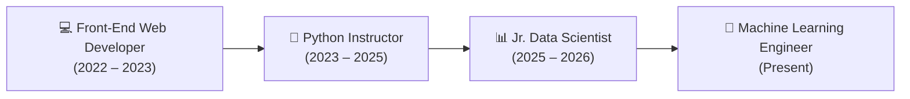

<div align="center">

# 🌟 Aniket Tayade | Portfolio

### **Machine Learning Engineer & Full-Stack Developer**

Building production-grade ML solutions, generative AI applications, and high-performance interactive web experiences.

[](https://nextjs.org/)
[](https://react.dev/)
[](https://www.typescriptlang.org/)
[](https://tailwindcss.com/)
[](https://threejs.org/)
[](https://www.framer.com/motion/)

<br />

[🔗 Live Portfolio](https://github.com/tayade-aniket) • [📄 Download Resume](/ml_enigneer_aniket_tayade_resume.pdf) • [💼 LinkedIn](https://in.linkedin.com/in/aniket-g-tayade) • [🏆 Kaggle](https://www.kaggle.com/annitayade) • [✉️ Email](mailto:tayadeanni@gmail.com)

</div>

---

## 📌 Executive Summary

I’m a **Machine Learning Engineer** with a strong foundation in software engineering and teaching. I specialize in turning messy data and complex machine learning architectures into reliable, scalable applications that solve real-world problems.

My journey spans data science, LLM/RAG pipelines, computer vision, and backend systems, paired with a solid background in modern front-end engineering.

> *"I like building practical AI solutions rather than chasing buzzwords. I’m especially interested in projects where AI can solve a real problem, simplify something complicated, or save someone a few hours of repetitive work."*

---

## ✨ Portfolio Key Features

- **Liquid Section Morph Transitions**: Custom cubic-bezier SVG morph dividers and GPU-accelerated backdrop glow animations creating smooth, continuous transitions across sections (`SectionMorphDivider`).
- **Interactive 3D Neural Network**: Real-time neural network canvas featuring pulsing gold hub nodes, synaptic interconnections, and orbital rotations powered by `@react-three/fiber` and Three.js.
- **3D Floating Mesh Role Cards**: Dynamic rotating icosahedron geometric orbs integrated into role cards responding to ambient light and perspective.
- **Dynamic Particle Field**: Optimized 3,000-point particle galaxy canvas built with Three.js BufferAttribute geometry for smooth rendering and production builds.
- **Morphing Section Spy Navbar**: Top navigation with fluid layout spring physics (`layoutId="navbarMorphPill"`) indicating the active section, plus a responsive mobile drawer.
- **Interactive Timeline**: Vertical timeline detailing professional journey across data science, instruction, and web development.
- **Skills Matrix with Dynamic Gauges**: Animated proficiency bars highlighting AI/ML, Languages, MLOps/Cloud, and Analytics.
- **Production Contact Form**: Integrated with Next.js App Router API route powered by Resend for direct email dispatch.

---

## 🛠️ Technology Stack

| Domain | Technologies & Libraries |
| :--- | :--- |
| **Frontend Framework** | Next.js 16 (App Router, Turbopack), React 19, TypeScript |
| **Styling & Design** | Tailwind CSS v4, Glassmorphism, CSS Custom Properties |
| **3D & Graphics** | Three.js, React Three Fiber (`@react-three/fiber`), Drei |
| **Animations** | Framer Motion 12 (Path Morphing, Spring Physics, Layout Animations) |
| **Icons & UI** | Lucide React, React Icons (Simple Icons) |
| **Machine Learning & AI** | PyTorch, Scikit-learn, XGBoost, LangChain, Groq LLM, YOLO, OpenCV, Tesseract OCR, BERT |
| **MLOps & Backend** | FastAPI, REST APIs, MLflow, Airflow, Docker, Git & GitHub, CI/CD, Streamlit, Resend |

---

## 🚀 Featured Projects

### 1. [Indian Road Accident Severity Prediction & Risk Analytics](https://github.com/tayade-aniket/indian_road_accident_severity)
- **Domain**: Machine Learning & Geospatial Analytics
- **Tech Stack**: `Python`, `Machine Learning`, `XGBoost`, `Model Evaluation`, `Geospatial Analytics`, `Streamlit`
- **Summary**: End-to-end ML system predicting road accident severity using 20K+ crash records across 49 features. Features comprehensive data preprocessing, EDA, feature engineering, and high-performance XGBoost classification (95.13% accuracy, 99.44% ROC-AUC), deployed as an interactive Streamlit web application with real-time severity prediction, risk hotspot maps, and analytics dashboard.
- **Links**: [GitHub Repository](https://github.com/tayade-aniket/indian_road_accident_severity) • [Live App](https://indianroadaccidentseverity.streamlit.app/)

### 2. [Medical Report OCR using YOLO & Tesseract](https://github.com/tayade-aniket/Medical-Report-OCR-YOLO-Tesseract)
- **Domain**: Computer Vision & Deep Learning
- **Tech Stack**: `YOLO`, `Tesseract OCR`, `OpenCV`, `Deep Learning`, `Google Colab`
- **Summary**: End-to-end medical document analysis system utilizing YOLO for anatomical/tabular region detection and Tesseract for accurate text extraction, automatically transforming unstructured diagnostic reports into clean JSON/CSV format.
- **Links**: [GitHub Repository](https://github.com/tayade-aniket/Medical-Report-OCR-YOLO-Tesseract)

### 3. [NEWS Research Analysis Tool](https://github.com/tayade-aniket/news_research_analysis)
- **Domain**: Generative AI & NLP
- **Tech Stack**: `Groq LLM`, `LangChain`, `Streamlit`, `Plotly`, `python-dotenv`
- **Summary**: Financial and research analysis platform that parses multi-source news articles, creates semantic vector embeddings, and enables conversational QA with instant verification, fact citation, and query history.
- **Links**: [GitHub Repository](https://github.com/tayade-aniket/news_research_analysis)

### 4. [Job Market Analytics Platform](https://github.com/tayade-aniket/job_market_analysis_NHIS)
- **Domain**: Data Analytics & NLP
- **Tech Stack**: `Python`, `Scikit-learn`, `NLTK`, `Plotly`, `Streamlit`
- **Summary**: Comprehensive data analytics platform evaluating real-time tech job postings to identify high-growth roles, salary distributions, emerging skill demands, and personalized career recommendations.
- **Links**: [GitHub Repository](https://github.com/tayade-aniket/job_market_analysis_NHIS)

### 5. [Twitter Disaster Classification](https://github.com/tayade-aniket/twitter_disaster_classification_NHITS)
- **Domain**: Natural Language Processing
- **Tech Stack**: `BERT`, `TF-IDF`, `Logistic Regression`, `Tokenization`, `Lemmatization`
- **Summary**: Disaster alert classification engine analyzing social media feeds in real time to categorize emergencies versus non-emergency chatter with high precision using TF-IDF and BERT transformer embeddings.
- **Links**: [GitHub Repository](https://github.com/tayade-aniket/twitter_disaster_classification_NHITS)

### 6. [Rossmann Store Sales Forecasting](https://github.com/tayade-aniket)
- **Domain**: Predictive Modeling & Time Series
- **Tech Stack**: `Random Forest`, `Gradient Boosting`, `XGBoost Regressor`, `Model Serialization`
- **Summary**: Predictive pipeline forecasting daily store sales across European retail locations, incorporating holiday schedules, promotions, and competitor distance features.
- **Links**: [GitHub Profile](https://github.com/tayade-aniket)

---

## 💼 Work Experience



- **Jr. Data Scientist** — *NextHike IT Solutions (2025 – 2026)*
  - Developed PyTorch-based computer vision models for object detection and image segmentation.
  - Built experiment tracking and versioning pipelines with MLflow and Docker.
  - Enhanced hyperparameter tuning routines, improving training throughput and model accuracy.
- **Python Instructor** — *Vision Computer Academy (2023 – 2025)*
  - Instructed 400+ students in core Python programming, data structures, and backend API engineering.
  - Conducted hands-on labs for RESTful APIs with FastAPI and Django, version control (Git), and CI/CD pipelines.
- **Front-End Web Developer** — *Freelance & Independent Projects (2022 – 2023)*
  - Engineered responsive, component-driven web applications using React, Next.js, and Tailwind CSS.
  - Optimized client-side asset delivery, core web vitals, and RESTful API integrations.

---

## 📂 Project Architecture & Folder Structure

```plaintext
portfolio/
├── public/                               # Static assets & public documents
│   ├── ml_enigneer_aniket_tayade_resume.pdf  # Curriculum Vitae / Resume PDF
│   ├── wolf.png                          # Brand asset image
│   ├── textures/
│   │   └── ai.png                        # Three.js 3D mesh texture
│   ├── file.svg                          # UI icon
│   ├── globe.svg                         # UI icon
│   ├── next.svg                          # Next.js logo
│   ├── vercel.svg                        # Vercel logo
│   └── window.svg                        # UI icon
├── src/
│   ├── app/
│   │   ├── api/
│   │   │   └── contact/                  # API routes
│   │   │       └── route.ts              # Resend email handler endpoint
│   │   ├── favicon.ico                   # Favicon icon
│   │   ├── globals.css                   # Tailwind v4 theme, morphing keyframes & utilities
│   │   ├── layout.tsx                    # Root layout with fonts, MouseGlow & Navbar
│   │   └── page.tsx                      # Main single page composed with SectionMorphDividers
│   └── components/
│       ├── About.tsx                     # Bio narrative, 3D role cards, CV download
│       ├── Contact.tsx                   # Interactive contact form & social links
│       ├── Experience.tsx                # Vertical timeline with career milestones
│       ├── Footer.tsx                    # Minimal footer with quick navigation & copyright
│       ├── Hero.tsx                      # Headline, gold accent bar & 3D Neural Network
│       ├── Navbar.tsx                    # Fixed scroll-spy navbar with animated pill indicator
│       ├── Projects.tsx                  # Interactive project showcase grid with live/code links
│       ├── Skills.tsx                    # Category skill gauges with animated progress bars
│       ├── canvas/
│       │   ├── FloatingShapes.tsx        # 3D Neural Network (NeuralNetCanvas3D) & Role Orbs (CardCanvas3D)
│       │   └── ParticleBackground.tsx    # 3,000-point particle galaxy (BufferAttribute optimized)
│       └── ui/
│           ├── MouseGlow.tsx             # Smooth cursor spotlight effect
│           └── SectionMorphDivider.tsx   # Liquid multi-path SVG morphing wave transitions
├── .env.local                            # Local environment variables (Resend API key)
├── eslint.config.mjs                     # ESLint configuration
├── next.config.ts                        # Next.js configuration
├── package.json                          # Dependencies & build scripts
├── postcss.config.mjs                    # PostCSS configuration for Tailwind CSS v4
├── tsconfig.json                         # TypeScript configuration
└── README.md                             # Comprehensive project documentation
```

---

## ⚡ Quick Start & Development Setup

### Prerequisites
- **Node.js**: v18.17+ or v20+
- **Package Manager**: `npm`, `yarn`, or `pnpm`

### Installation

1. **Clone the repository:**
   ```bash
   git clone https://github.com/tayade-aniket/portfolio.git
   cd portfolio
   ```

2. **Install dependencies:**
   ```bash
   npm install
   ```

3. **Configure Environment Variables:**
   Create a `.env.local` file in the root directory:
   ```env
   # Email Service (Contact Form via Resend)
   RESEND_API_KEY=your_resend_api_key_here
   ```

4. **Run the local development server:**
   ```bash
   npm run dev
   ```
   Open [http://localhost:3000](http://localhost:3000) in your browser.

5. **Build for production:**
   ```bash
   npm run build
   npm run start
   ```

---

## 📬 Contact & Connect

- **Name**: Aniket Tayade
- **Role**: Machine Learning Engineer
- **Email**: [tayadeanni@gmail.com](mailto:tayadeanni@gmail.com)
- **LinkedIn**: [in/aniket-g-tayade](https://in.linkedin.com/in/aniket-g-tayade)
- **GitHub**: [github.com/tayade-aniket](https://github.com/tayade-aniket)
- **Kaggle**: [kaggle.com/annitayade](https://www.kaggle.com/annitayade)

---

<div align="center">
  <sub>Designed & Developed with ❤️ by Aniket Tayade. All rights reserved.</sub>
</div>
